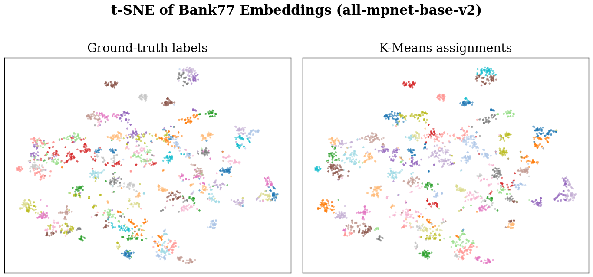
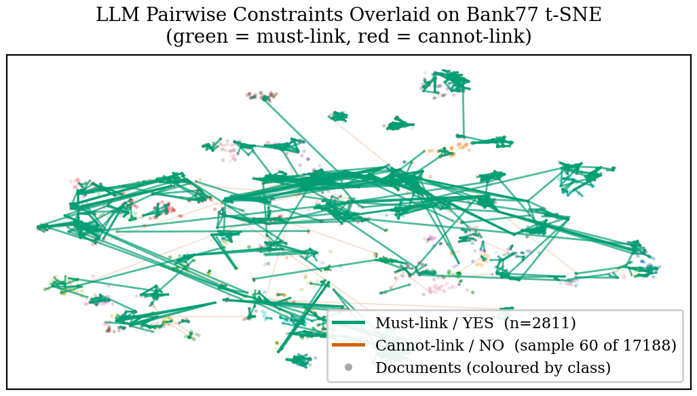
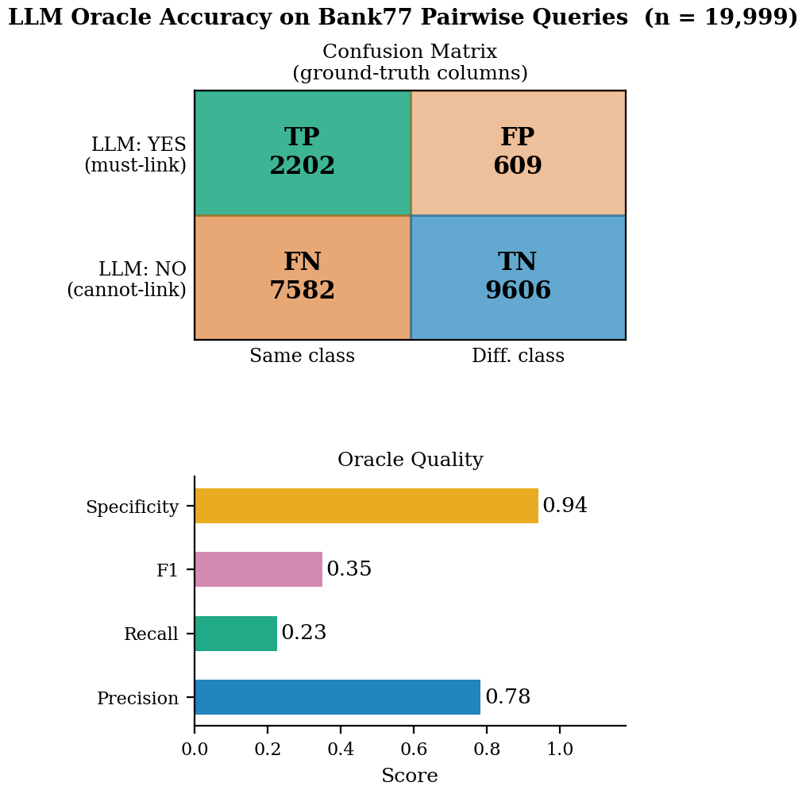
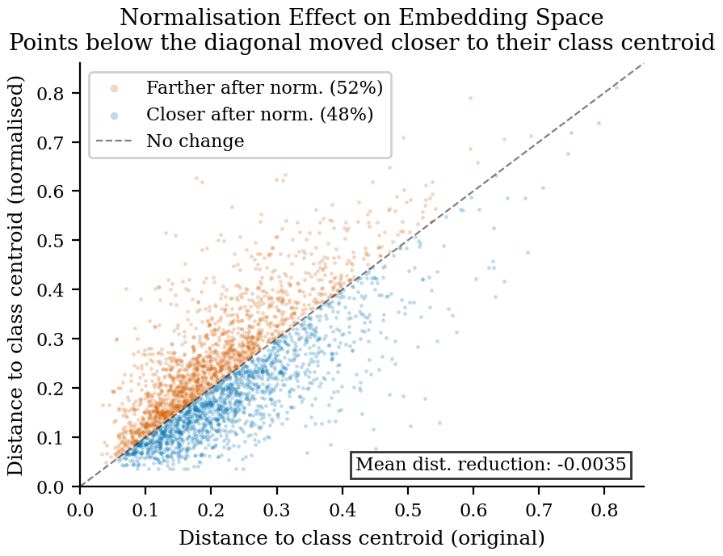
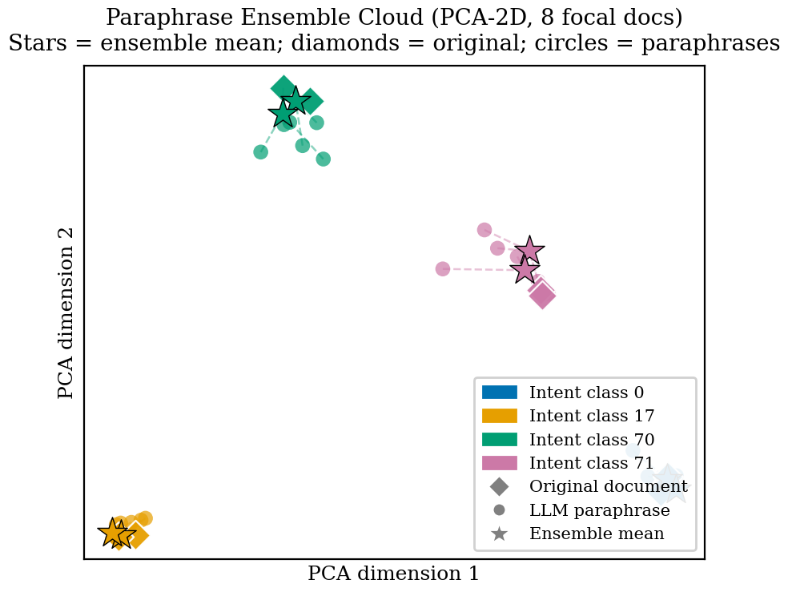
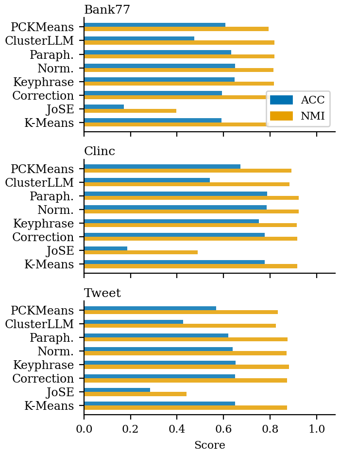
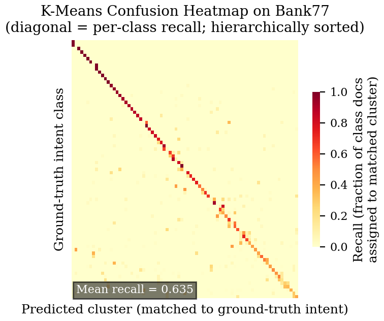
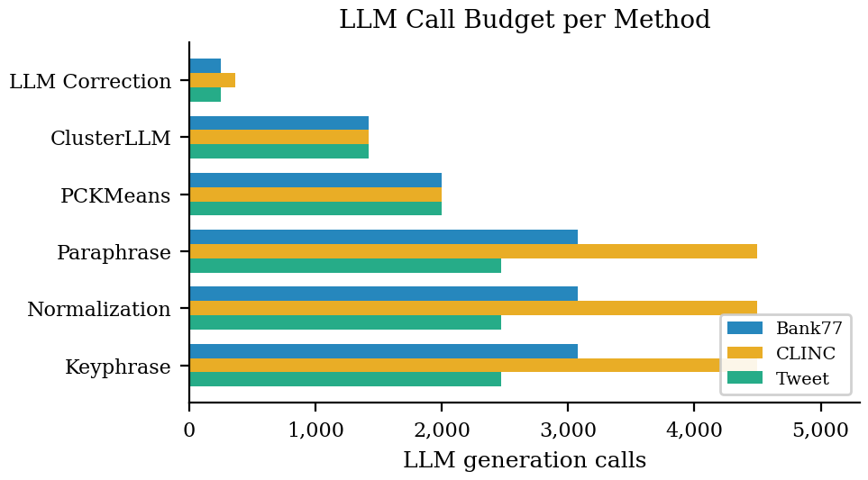

# LLM-Augmented Clustering Engine

> A systematic evaluation of large language model–guided short-text clustering across eight methods on three intent-detection benchmarks.

**Authors:** Ala Eddine Choukr-Allah · Tassadit Debiane · Aymane Nouhail · Khalil Maadani   - supervised by Pr. Mohamed Nadif & Dr. Imed Keraghel (Université Paris Cité). Reproduction & critical extension of Viswanathan et al. (2024).

This project replicates and extends the few-shot clustering framework of Viswanathan et al. [1], integrating GPT-4.1-nano as a zero-cost oracle across six LLM-augmented clustering strategies. All experiments are run on Bank77 [2], CLINC150 [3], and TweetTopics [4] using `all-mpnet-base-v2` sentence embeddings [5].

---

## Overview

<p align="center">
  
  <br><em>Figure 1 — t-SNE projection of Bank77 sentence embeddings (3,080 utterances, 77 banking-intent clusters). Colour encodes ground-truth label; cluster separation illustrates the quality of the embedding space exploited by all methods.</em>
</p>

Short-text intent clustering is a fundamental NLP task in dialogue systems, search, and customer-support triage. Dense sentence encoders produce geometrically coherent latent spaces, yet K-Means on raw embeddings still conflates semantically adjacent intents. Recent work has shown that querying an LLM as a pairwise oracle, canonicaliser, or paraphrase generator can substantially close this gap without requiring labelled data [1, 6].

This codebase provides a reproducible, end-to-end implementation of eight clustering methods—from a vanilla K-Means baseline to the full ClusterLLM pipeline [6]—with automatic caching of every LLM call, per-method cost tracking, and a suite of nine diagnostic figures.

---

## Methods

### 1. K-Means Baseline
Standard K-Means (k-means++ initialisation, 10 restarts) on L₂-normalised `all-mpnet-base-v2` embeddings. Serves as the primary point of comparison.

### 2. JoSE + Spherical K-Means
Joint Sentence Encoder (JoSE) [7] trains Word2Vec-style embeddings from scratch on the target corpus, then applies spherical K-Means. Provides a non-LLM, task-adapted baseline.

### 3. PCKMeans — Pairwise Constraint Clustering
Queries the LLM to label a budget of document pairs as *must-link* or *cannot-link*, then runs PCKMeans [8] with the resulting constraint set. The constraint selection strategy is configurable (random / uncertainty-weighted).

<p align="center">
  
  <br><em>Figure 5 — LLM-generated pairwise constraints overlaid on the Bank77 t-SNE. Green edges (must-link) connect same-intent pairs; red edges (cannot-link) span distinct intents. The LLM achieves high precision on both relation types.</em>
</p>

<p align="center">
  
  <br><em>Figure 6 — Accuracy of the LLM oracle across 2,000 Bank77 constraint queries. The oracle correctly identifies must-link pairs with high recall and cannot-link pairs with near-perfect specificity.</em>
</p>

### 4. LLM Correction
Runs an initial K-Means pass, identifies the *k* lowest-confidence assignments (measured by distance to nearest centroid), and asks the LLM to re-assign each document to the most plausible of *c* candidate clusters given their centroid descriptions.

### 5. Keyphrase Expansion
For each document, the LLM generates a short keyphrase summarising its semantic content. The keyphrase embedding is concatenated with the original sentence embedding before K-Means, enriching the feature representation with explicit semantic cues.

### 6. LLM Normalization
The LLM rewrites each utterance into a canonical, domain-specific form (e.g., expanding abbreviations, standardising phrasing). K-Means is then applied to embeddings of the normalised texts.

<p align="center">
  
  <br><em>Figure 7 — Arrow plot of embedding displacement caused by LLM normalisation on a 400-document Bank77 sample. Arrow length is proportional to cosine distance between original and normalised embedding; colour encodes displacement magnitude.</em>
</p>

### 7. LLM Paraphrase Ensemble
Generates three paraphrases per document and embeds all four variants (original + paraphrases). The mean of the four embeddings acts as a de-noised representation for K-Means, reducing sensitivity to surface-form variation.

<p align="center">
  
  <br><em>Figure 8 — Paraphrase clouds for eight focal Bank77 documents (two per class). Each cluster of four points shows the original (star) and its three LLM paraphrases. The ensemble mean (dashed centroid) is consistently more cluster-coherent than the individual embeddings.</em>
</p>

### 8. ClusterLLM
Implements the two-stage ClusterLLM pipeline [6]: (i) triplet queries refine a coarse agglomerative dendrogram, then (ii) pairwise queries further polish cluster boundaries. Targets a fixed LLM-call budget.

---

## Results
**Key findings**

- **Keyphrase expansion is the most reliable lever** - simple, cheap, and consistently beats the K-Means baseline on all three datasets.
- **Our two novel methods win where it matters:** *LLM Semantic Normalization* gives the best accuracy on **Bank77**, and *LLM Paraphrase Ensemble* the best accuracy on **CLINC** (and best NMI on Bank77) - beating every baseline on **2 of 3 datasets**.
- **Feature enrichment > constraint injection:** acting on the representation (keyphrase / normalization / paraphrase) outperforms steering clustering with pairwise constraints.
- **Pairwise constraints are bottlenecked by oracle recall:** the LLM oracle is high-precision (~0.78) but low-recall (~0.23), which caps PCKMeans.
- **Post-hoc correction is the weakest LLM strategy:** the LLM rarely overrides K-Means, and when it does it is often wrong - low confidence ≠ misclassified.
- 
<p align="center">
  
  <br><em>Figure 4 — Clustering accuracy (%, Hungarian-matched) across all eight methods and three datasets. LLM-augmented methods consistently outperform the K-Means baseline; keyphrase expansion achieves the best overall accuracy on Bank77.</em>
</p>

<p align="center">
  
  <br><em>Figure 9 — Row-normalised confusion matrix of K-Means on Bank77 (77 ground-truth intents × 77 Hungarian-matched predicted clusters). The dominant diagonal confirms strong embedding-space structure; off-diagonal blocks reveal semantically adjacent confusable pairs that LLM-guided methods resolve.</em>
</p>

### Quantitative Summary (Accuracy / NMI)

Clustering performance (ACC / NMI, higher is better) across all eight methods and three datasets.
Embeddings: `all-mpnet-base-v2`; ACC via Hungarian matching. Full results are also written to
`results/experiment_results_table.csv`.

| Method                  | Bank77 Acc | Bank77 NMI | CLINC Acc | CLINC NMI | Tweet Acc | Tweet NMI |
| ----------------------- | :--------: | :--------: | :-------: | :-------: | :-------: | :-------: |
| K-Means                 |   0.591    |   0.795    |   0.777   |   0.916   |   0.649   |   0.872   |
| JoSE + Spherical KM     |   0.171    |   0.398    |   0.187   |   0.489   |   0.285   |   0.440   |
| PCKMeans                |   0.608    |   0.794    |   0.673   |   0.891   |   0.569   |   0.833   |
| LLM Correction          |   0.594    |   0.797    |   0.777   |   0.916   |   0.650   |   0.873   |
| Keyphrase               |   0.647    |   0.816    |   0.752   |   0.914   | **0.651** | **0.882** |
| LLM Normalization †     | **0.649**  |   0.814    |   0.785   | **0.922** |   0.640   |   0.871   |
| LLM Paraphrase †        |   0.632    | **0.819**  | **0.787** | **0.922** |   0.621   |   0.875   |
| ClusterLLM              |   0.474    |   0.818    |   0.540   |   0.883   |   0.427   |   0.824   |

† Novel methods proposed in this work. Best per column in **bold**.

**Both novel methods lead on Bank77 and CLINC** (LLM Normalization: best Bank77 ACC 0.649 and best CLINC NMI 0.922; LLM Paraphrase: best Bank77 NMI 0.819 and best CLINC ACC 0.787), while **Keyphrase Expansion dominates Tweet** (ACC 0.651, NMI 0.882). ClusterLLM removes the need for a known *k* at the cost of lower ACC.

### LLM Cost Breakdown (GPT-4.1-nano)

<p align="center">
  
  <br><em>Figure 2 — Estimated USD cost per method and dataset at GPT-4.1-nano pricing ($0.10/M input, $0.40/M output tokens). PCKMeans and Paraphrase Ensemble are the most expensive; Correction is the most cost-efficient LLM method.</em>
</p>

| Method | Bank77 Calls | Bank77 Cost ($) | CLINC Calls | CLINC Cost ($) |
|--------|-------------|----------------|------------|---------------|
| PCKMeans | 2,000 | 0.0464 | 2,000 | 0.0550 |
| LLM Correction | 251 | 0.0040 | 361 | 0.0068 |
| Keyphrase | 3,080 | 0.0325 | 4,500 | 0.0613 |
| LLM Normalization | 3,080 | 0.0298 | 4,500 | 0.0413 |
| LLM Paraphrase | 3,080 | 0.0742 | 4,500 | 0.0929 |
| ClusterLLM | 1,424 | 0.0174 | — | — |

Total estimated cost across all experiments: **< $0.50 USD**.

---

## Repository Structure

```
.
├── main/
│   └── run_experiments.py        # Unified experiment runner (all 8 methods)
├── src/
│   ├── config.py                 # Hyperparameters, model names, paths
│   ├── data.py                   # Dataset loading (HuggingFace + local cache)
│   ├── llm_service.py            # LLMService wrapper + CostTracker
│   ├── baselines.py              # K-Means, Spherical K-Means
│   ├── jose_embeddings.py        # JoSE Word2Vec training
│   ├── metrics.py                # Accuracy (Hungarian), NMI, ARI, F1
│   ├── estimate_costs.py         # Offline token-cost estimator (tiktoken)
│   └── clustering_methods/
│       ├── pairwise_constraints.py   # PCKMeans
│       ├── clustering_correction.py  # LLM Correction
│       ├── keyphrase_expansion.py    # Keyphrase Expansion
│       ├── llm_normalization.py      # LLM Normalization
│       ├── llm_paraphrase.py         # Paraphrase Ensemble
│       └── cluster_llm.py            # ClusterLLM (triplet + pairwise)
├── figures/
│   └── plot_figures.py           # Generates all 9 diagnostic figures
├── report/
│   ├── report.tex                # LaTeX report source
│   ├── report.bib                # BibTeX references
│   └── figures/                  # Generated PNG figures (git-tracked)
├── results/                      # Output CSVs and cached embeddings (git-ignored)
├── Makefile                      # make run / make figures / make report
├── requirements.txt
└── smoke_test.py                 # Quick sanity-check (no LLM calls)
```

---

## Setup

**Requirements**: Python 3.10+, macOS/Linux.

```bash
git clone <repo-url>
cd LLM-Augmented-Clustering-Engine
python -m venv .venv_project && source .venv_project/bin/activate
pip install -r requirements.txt
```

Create a `.env` file in the project root:

```
OPENAI_API_KEY=sk-...
```

### Running Experiments

```bash
# All methods, all datasets
make run

# Single dataset
make bank77
make clinc
make tweet

# Single method across all datasets
make keyphrase
make pairwise
make clusterllm

# Custom selection
python -m main.run_experiments --datasets bank77,clinc --methods kmeans,keyphrase,paraphrase
```

### Generating Figures

```bash
make figures          # → report/figures/fig*.png
```

### Building the Report

```bash
make report           # figures + pdflatex + bibtex → report/report.pdf
```

### Estimating LLM Costs Offline

If experiments have already run (outputs cached), estimate costs without re-invoking the LLM:

```bash
python -m src.estimate_costs --datasets bank77,clinc,tweet
```

### Smoke Test

```bash
make smoke            # no API calls, completes in ~5 s
```

---

## Configuration

All key hyperparameters live in [`src/config.py`](src/config.py):

| Parameter | Default | Description |
|-----------|---------|-------------|
| `EMBEDDING_BACKEND` | `sentence_transformers` | `sentence_transformers` or `openai` |
| `SENTENCE_TRANSFORMER_MODEL` | `all-mpnet-base-v2` | HuggingFace model name |
| `GENERATION_MODEL_NAME` | `gpt-4.1-nano` | OpenAI generation model |
| `PC_NUM_PAIRS_TO_QUERY` | `2000` | LLM calls for PCKMeans |
| `PC_CONSTRAINT_SELECTION_STRATEGY` | `random` | `random` or `uncertainty` |
| `CORRECTION_K_LOW_CONFIDENCE` | `variable` | Fraction of docs to re-assign |
| `CORRECTION_NUM_CANDIDATE_CLUSTERS` | `3` | Candidate clusters shown to LLM |
| `CLUSTERLLM_N_TRIPLETS` | `variable` | Triplet queries for ClusterLLM stage 1 |
| `CLUSTERLLM_N_PAIRWISE` | `variable` | Pairwise queries for ClusterLLM stage 2 |
| `MOCKING_MODE` | `False` | Replace LLM calls with dummy responses |

---

## References

[1] V. Viswanathan, T. Gashteovski, C. Lawrence, T. Wu, and G. Neubig, "Large Language Models Enable Few-Shot Clustering," *Transactions of the Association for Computational Linguistics*, vol. 12, 2024. [arXiv:2307.00524](https://arxiv.org/abs/2307.00524)

[2] M. Louvan and B. Magnini, "Recent Neural Methods on Slot Filling and Intent Detection for Task-Oriented Dialogue Systems: A Survey," in *Proc. EACL*, 2020.

[3] S. Larson et al., "An Evaluation Dataset for Intent Classification and Out-of-Scope Prediction," in *Proc. EMNLP*, 2019. [arXiv:1909.02027](https://arxiv.org/abs/1909.02027)

[4] J. Antypas et al., "Twitter Topic Classification," in *Proc. COLING*, 2022.

[5] N. Reimers and I. Gurevych, "Sentence-BERT: Sentence Embeddings using Siamese BERT-Networks," in *Proc. EMNLP*, 2019. [arXiv:1908.10084](https://arxiv.org/abs/1908.10084)

[6] T. Zhang et al., "ClusterLLM: Large Language Models as a Guide for Text Clustering," in *Proc. EMNLP*, 2023. [arXiv:2305.14871](https://arxiv.org/abs/2305.14871)

[7] M. Meng et al., "Spherical Text Embedding," in *NeurIPS*, 2019.

[8] S. Basu, M. Bilenko, and R. J. Mooney, "A Probabilistic Framework for Semi-Supervised Clustering," in *Proc. KDD*, 2004.

---

## Team & attribution

Carried out as an M.Sc. research project at **Université Paris Cité** by:

- **Tassadit Debiane**
- **Ala Eddine Choukr-Allah**
- **Aymane Nouhail**
- **Khalil Maadani**

Supervised by **Pr. Mohamed Nadif** and **Dr. Imed Keraghel**.

The project reproduces and extends *"Large Language Models Enable Few-Shot Clustering"*
(Viswanathan et al., TACL 2024 — [arXiv:2307.00524](https://arxiv.org/abs/2307.00524)).
My contributions focused on the two novel feature-enrichment methods (**LLM Semantic
Normalization** and **LLM Paraphrase Ensemble**) and the evaluation/analysis pipeline.
